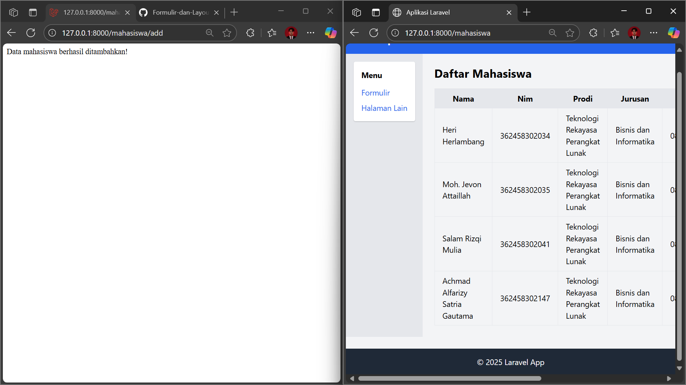
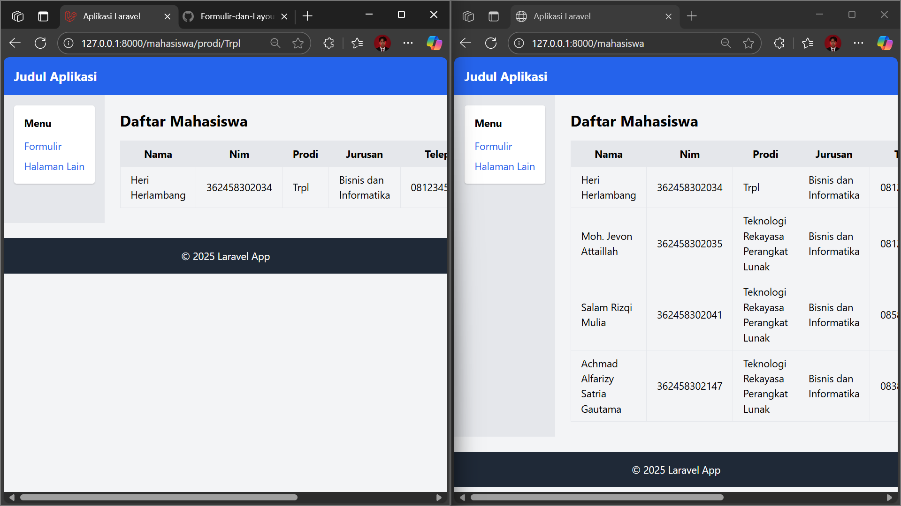

# Praktikum Laravel - Manajemen Data Mahasiswa
**Nama** : Moh. Jevon Attaillah  
**Kelas** : Trpl 2D  
**NIM** : 362458302035  
**Mata Kuliah** : Pemrograman Web Lanjut  
---
## 1. Tujuan
- Menambahkan field `email` pada tabel `mahasiswa` melalui migration baru.  
- Mengupdate Seeder agar menyertakan data `email`.  
- Menampilkan field `email` di view tabel mahasiswa.  
- (Nilai tambah) Membuat Model, Controller, View, dan Formulir input menggunakan Eloquent.  
---
## 2. Langkah Praktikum 
### 2.1. Migration
Perintah:
```
php artisan make:migration create_mahasiswa
```
Perintah ini digunakan untuk membuat file migration baru.
File tersebut berfungsi mendefinisikan struktur tabel mahasiswa di database.
Pada file `database/migrations/2025_09_30_035925_create_mahasiswa.php` ditambahkan kode berikut:
```php
<?php

use Illuminate\Database\Migrations\Migration;
use Illuminate\Database\Schema\Blueprint;
use Illuminate\Support\Facades\Schema;

return new class extends Migration
{
    public function up(): void
    {
        Schema::create('mahasiswa', function (Blueprint $table) {
            $table->id();
            $table->string('nama');
            $table->string('email');
            $table->string('telepon');
            $table->text('alamat');
            $table->timestamps();
        });
    }

    public function down(): void
    {
        Schema::dropIfExists('mahasiswa');
    }
};
```
Kemudian jalankan perintah berikut untuk mengeksekusi migration:
```
php artisan migrate
```
### 2.2. Seeder
Perintah:
```
php artisan make:seeder MahasiswaSeeder
```
Perintah ini digunakan untuk membuat file Seeder baru.
Seeder berfungsi untuk mengisi data awal ke tabel mahasiswa, misalnya nama, email, telepon, dan alamat.
Isi file `database/seeders/MahasiswaSeeder.php`:
```php
<?php

namespace Database\Seeders;

use Illuminate\Database\Console\Seeds\WithoutModelEvents;
use Illuminate\Database\Seeder;

class MahasiswaSeeder extends Seeder
{
    public function run(): void
    {
        \DB::table('mahasiswa')->insert([
            [
                'nama' => 'Moh. Jevon Attaillah',
                'email' => 'dilan271594@gmail.com',
                'telepon' => '081238678123',
                'alamat' => 'Singotrunan, Banyuwammgi',
                'created_at' => now(),
                'updated_at' => now(),
            ],
            [
                'nama' => 'Salam Rizqi Mulia',
                'email' => 'salambaee@gmail.com',
                'telepon' => '085815429154',
                'alamat' => 'Tukang Kayu, Banyuwammgi',
                'created_at' => now(),
                'updated_at' => now(),
            ],
            [
                'nama' => 'Achmad Alfarizy Satria Gautama',
                'email' => 'fariz@gmail.com',
                'telepon' => '083897883889',
                'alamat' => 'Sobo, Banyuwammgi',
                'created_at' => now(),
                'updated_at' => now(),
            ],
        ]);
    }
}
```
Tambahkan ke `sedeers/DatabaseSeeder.php`:
```php
$this->call(MahasiswaSeeder::class);
```
Kode ini digunakan agar MahasiswaSeeder dijalankan saat proses seeding.
Jalankan perintah:
```
php artisan migrate:fresh --seed
```
Perintah ini akan mengulang migration dari awal (membuat ulang tabel) lalu langsung mengisi tabel mahasiswa dengan data awal dari seeder.
Hasilnya, tabel mahasiswa sudah terisi otomatis tanpa input manual.
### 2.3. Model
```
php artisan make:model Mahasiswa
```
Perintah ini digunakan untuk membuat model baru bernama Mahasiswa agar bisa berhubungan langsung dengan tabel mahasiswa.

Isi `app/Models/Mahasiswa.php`:
```php
<?php

namespace App\Models;

use Illuminate\Database\Eloquent\Factories\HasFactory;
use Illuminate\Database\Eloquent\Model;

class Mahasiswa extends Model
{
    use HasFactory;

    protected $table = 'mahasiswa';

    protected $fillable = ['nama', 'email', 'telepon', 'alamat'];
}
```
### 2.4. Controller
```
php artisan make:controller MahasiswaController --resource
```
Perintah ini membuat controller dengan method dasar CRUD (index, create, store, dll).
Tambahkan kode ini pada app\Http\Controllers\MahasiswaController.php:
```php
<?php

namespace App\Http\Controllers;

use App\Models\Mahasiswa;
use Illuminate\Http\Request;

class MahasiswaController extends Controller
{
    public function index()
    {
        $mahasiswa = Mahasiswa::all();
        return view('mahasiswa.index', compact('mahasiswa'));
    }

    public function create()
    {
        return view('mahasiswa.create');
    }

    public function store(Request $request)
    {
        $validated = $request->validate([
            'nama' => 'required|min:3',
            'email' => 'required|email|unique:mahasiswa',
            'telepon' => 'required|digits_between:10,15',
            'alamat' => 'required|min:5',
        ]);

        Mahasiswa::create($validated);

        return redirect()->route('mahasiswa.index')->with('success', 'Data mahasiswa berhasil ditambahkan.');
    }
}
```
Kode di atas mengatur alur logika: menampilkan data, menampilkan form, serta menyimpan data baru setelah divalidasi.
### 2.5. View
**Index (`resources/views/mahasiswa/index.blade.php`):**
```php
@extends('layouts.app')

@section('content')
    <h2 class="text-2xl font-bold mb-4">Daftar Mahasiswa</h2>

    @if(session('success'))
        <div class="bg-green-100 text-green-700 p-3 mb-4 rounded">
            {{ session('success') }}
        </div>
    @endif

    <table class="table-auto border-collapse border w-full">
        <thead>
            <tr class="bg-gray-200">
                <th class="border px-4 py-2">ID</th>
                <th class="border px-4 py-2">Nama</th>
                <th class="border px-4 py-2">Email</th>
                <th class="border px-4 py-2">Telepon</th>
                <th class="border px-4 py-2">Alamat</th>
            </tr>
        </thead>
        <tbody>
            @foreach($mahasiswa as $m)
                <tr>
                    <td class="border px-4 py-2">{{ $m->id }}</td>
                    <td class="border px-4 py-2">{{ $m->nama }}</td>
                    <td class="border px-4 py-2">{{ $m->email }}</td>
                    <td class="border px-4 py-2">{{ $m->telepon }}</td>
                    <td class="border px-4 py-2">{{ $m->alamat }}</td>
                </tr>
            @endforeach
        </tbody>
    </table>
@endsection
```
View ini menampilkan daftar mahasiswa dalam bentuk tabel.
**Create (`resources/views/mahasiswa/create.blade.php`):**
```
@extends('layouts.app')

@section('content')
    <h2 class="text-2xl font-bold mb-4">Tambah Mahasiswa</h2>

    <form action="{{ route('mahasiswa.store') }}" method="POST" class="bg-white p-6 rounded shadow-md">
        @csrf

        <div class="mb-4">
            <label>Nama</label>
            <input type="text" name="nama" class="border rounded w-full p-2">
        </div>

        <div class="mb-4">
            <label>Email</label>
            <input type="email" name="email" class="border rounded w-full p-2">
        </div>

        <div class="mb-4">
            <label>Telepon</label>
            <input type="text" name="telepon" class="border rounded w-full p-2">
        </div>

        <div class="mb-4">
            <label>Alamat</label>
            <textarea name="alamat" class="border rounded w-full p-2"></textarea>
        </div>

        <button type="submit" class="bg-blue-600 text-white px-4 py-2 rounded">Simpan</button>
    </form>
@endsection
```
View ini menampilkan form input untuk menambahkan data mahasiswa baru.
### 2.6. Routing
`routes/web.php`:
```
use App\Http\Controllers\MahasiswaController;
Route::resource('mahasiswa', MahasiswaController::class);
```
Routing ini otomatis membuat endpoint CRUD untuk mahasiswa, misalnya `/mahasiswa` untuk index, dan `/mahasiswa/create` untuk form input.
## 3. Hasil Uji Coba
- **Halaman `/mahasiswa`** menampilkan tabel daftar mahasiswa lengkap dengan kolom **Nama, Email, Telepon, Alamat**.

- **Seeder** berhasil menambahkan 3 data mahasiswa.  

- **Formulir `/mahasiswa/create`** dapat menyimpan data baru ke database. 


Data berhasil ditambahkan

# Integrasi Database di Laravel (Migration, Seeder, dan Query Builder)

## 1. Menambahkan Kolom Baru di Migration
Pada file `database/migrations/2025_09_30_035925_create_mahasiswa.php`, ditambahkan kolom **nim**, **prodi**, dan **jurusan** agar tabel mahasiswa lebih lengkap.  
Migration berfungsi untuk membuat struktur tabel di database agar konsisten.

```php
<?php

use Illuminate\Database\Migrations\Migration;
use Illuminate\Database\Schema\Blueprint;
use Illuminate\Support\Facades\Schema;

return new class extends Migration
{
    public function up(): void
    {
        Schema::create('mahasiswa', function (Blueprint $table) {
            $table->id();
            $table->string('nama');
            $table->string('nim')->unique();
            $table->string('prodi');
            $table->string('jurusan');
            $table->string('telepon');
            $table->string('email');
            $table->text('alamat');
            $table->timestamps();
        });
    }

    public function down(): void
    {
        Schema::dropIfExists('mahasiswa');
    }
};
```

Jalankan perintah:
```bash
php artisan migrate
```

Jika gagal karena tabel lama masih ada, gunakan:
```bash
php artisan migrate:fresh
```
Perintah ini akan menghapus semua tabel lama lalu membuat ulang sesuai migration.

---

## 2. Menyinkronkan Seeder
Seeder digunakan untuk mengisi data awal ke tabel. Data ini bisa dipakai untuk uji coba.  
Pada `database/seeders/MahasiswaSeeder.php`, isi disesuaikan dengan kolom baru.

```php
<?php

namespace Database\Seeders;

use Illuminate\Database\Seeder;
use Illuminate\Support\Facades\DB;

class MahasiswaSeeder extends Seeder
{
    public function run(): void
    {
        DB::table('mahasiswa')->insert([
            [
                'nama' => 'Moh. Jevon Attaillah',
                'nim' => '362458302035',
                'prodi' => 'Teknologi Rekayasa Perangkat Lunak',
                'jurusan' => 'Bisnis dan Informatika',
                'telepon' => '081238678123',
                'email' => 'dilan271594@gmail.com',
                'alamat' => 'Singotrunan, Banyuwangi',
                'created_at' => now(),
                'updated_at' => now(),
            ],
            [
                'nama' => 'Salam Rizqi Mulia',
                'nim' => '362458302041',
                'prodi' => 'Teknologi Rekayasa Perangkat Lunak',
                'jurusan' => 'Bisnis dan Informatika',
                'telepon' => '085815429154',
                'email' => 'salambaee@gmail.com',
                'alamat' => 'Tukang Kayu, Banyuwangi',
                'created_at' => now(),
                'updated_at' => now(),
            ],
            [
                'nama' => 'Achmad Alfarizy Satria Gautama',
                'nim' => '362458302147',
                'prodi' => 'Teknologi Rekayasa Perangkat Lunak',
                'jurusan' => 'Bisnis dan Informatika',
                'telepon' => '083897883889',
                'email' => 'fariz@gmail.com',
                'alamat' => 'Sobo, Banyuwangi',
                'created_at' => now(),
                'updated_at' => now(),
            ],
        ]);
    }
}
```

Jalankan dengan:
```bash
php artisan db:seed --class=MahasiswaSeeder
```
Fungsinya untuk menambahkan data awal ke tabel `mahasiswa`.

---

## 3. Menambahkan Routing dengan Query Builder
Query Builder dipakai untuk operasi database tanpa perlu SQL manual.  
Tambahkan beberapa route di `routes/web.php` untuk **lihat data, tambah, update, dan hapus**.

```php
use Illuminate\Support\Facades\DB;

Route::get('/mahasiswa', function () {
    $mahasiswa = DB::table('mahasiswa')->get();
    return view('mahasiswa.index', compact('mahasiswa'));
});

Route::get('/mahasiswa/prodi/{prodi}', function ($prodi) {
    $mahasiswa = DB::table('mahasiswa')->where('prodi', $prodi)->get();
    return view('mahasiswa.index', compact('mahasiswa'));
});


Route::get('/mahasiswa/add', function () {
    DB::table('mahasiswa')->insert([
        [
            'nama' => 'Heri Herlambang',
            'nim' => '362458302034',
            'prodi' => 'Teknologi Rekayasa Perangkat Lunak',
            'jurusan' => 'Bisnis dan Informatika',
            'telepon' => '081234567890',
            'email' => 'heri@example.com',
            'alamat' => 'Situbondo',
            'created_at' => now(),
            'updated_at' => now(),
        ]
    ]);
    return "Data mahasiswa berhasil ditambahkan!";
});

Route::get('/mahasiswa/update/{nim}', function ($nim) {
    DB::table('mahasiswa')->where('nim', $nim)->update([
        'prodi' => 'Trpl'
    ]);
    return "Data mahasiswa dengan NIM $nim berhasil diupdate!";
});

Route::get('/mahasiswa/delete/{nim}', function ($nim) {
    DB::table('mahasiswa')->where('nim', $nim)->delete();
    return "Data mahasiswa dengan NIM $nim berhasil dihapus!";
});
```

---

## 4. View Tabel Mahasiswa
View digunakan untuk menampilkan data ke browser.  
File: `resources/views/mahasiswa/index.blade.php`

```php
@extends('layouts.app')

@section('content')
    <h2 class="text-2xl font-bold mb-4">Daftar Mahasiswa</h2>

    <table class="table-auto border-collapse border w-full">
        <thead>
            <tr class="bg-gray-200">
                <th class="border px-4 py-2">Nama</th>
                <th class="border px-4 py-2">NIM</th>
                <th class="border px-4 py-2">Prodi</th>
                <th class="border px-4 py-2">Jurusan</th>
                <th class="border px-4 py-2">Telepon</th>
                <th class="border px-4 py-2">Email</th>
                <th class="border px-4 py-2">Alamat</th>
            </tr>
        </thead>
        <tbody>
            @foreach($mahasiswa as $m)
                <tr>
                    <td class="border px-4 py-2">{{ $m->nama }}</td>
                    <td class="border px-4 py-2">{{ $m->nim }}</td>
                    <td class="border px-4 py-2">{{ $m->prodi }}</td>
                    <td class="border px-4 py-2">{{ $m->jurusan }}</td>
                    <td class="border px-4 py-2">{{ $m->telepon }}</td>
                    <td class="border px-4 py-2">{{ $m->email }}</td>
                    <td class="border px-4 py-2">{{ $m->alamat }}</td>
                </tr>
            @endforeach
        </tbody>
    </table>
@endsection
```

---

## 5. Uji Coba
Jalankan server:
```bash
php artisan serve
```

Coba akses:

- `http://localhost:8000/mahasiswa` (tampil semua data) 
    
- `http://localhost:8000/mahasiswa/add` (tambah data)
    
- `http://localhost:8000/mahasiswa/update/362458302034` (update data) berdasarkan NIM 
    
- `http://localhost:8000/mahasiswa/prodi/TRPL` (filter data per prodi)
    
- `http://localhost:8000/mahasiswa/delete/362458302041` (hapus data) berdasarkan NIM 
    

---

## Kesimpulan
- Migration digunakan untuk membuat dan menjaga struktur tabel.  
- Seeder dipakai untuk menambahkan data awal dengan cepat.  
- Query Builder memudahkan CRUD tanpa menulis SQL panjang.  
- Data mahasiswa sekarang lebih lengkap karena ada **NIM, Prodi, dan Jurusan**.  

# Laporan Praktikum Laravel – Manajemen Data Mahasiswa dengan CRUD dan Formulir

**Nama:** Moh. Jevon Attaillah  
**NIM:** 362458302035  
**Jurusan:** Bisnis dan Informatika  
**Program Studi:** Teknologi Rekayasa Perangkat Lunak  
---

## Fitur Utama
- Menampilkan daftar mahasiswa.
- Menambahkan data mahasiswa baru.
- Mengedit dan menghapus data mahasiswa.
- Mencari mahasiswa berdasarkan nama.
- Menampilkan data dengan pagination.

---

## Daftar File yang Dimodifikasi / Ditambahkan

### 1. **Model: `app/Models/Mahasiswa.php`**
```php
<?php

namespace App\Models;

use Illuminate\Database\Eloquent\Factories\HasFactory;
use Illuminate\Database\Eloquent\Model;

class Mahasiswa extends Model
{
    use HasFactory;

    protected $table = 'mahasiswa';
    protected $primaryKey = 'nim';
    public $incrementing = false;
    protected $keyType = 'string';

    protected $fillable = [
        'nim', 'nama', 'prodi', 'jurusan', 'telepon', 'email', 'alamat'
    ];
}
```
**Penjelasan:**
- File ini **ditambahkan** untuk mendefinisikan struktur model `Mahasiswa`.
- Menentukan nama tabel, primary key (`nim`), dan kolom yang bisa diisi (`$fillable`).

---

### 2. **Controller: `app/Http/Controllers/MahasiswaController.php`**
```php
<?php

namespace App\Http\Controllers;

use App\Models\Mahasiswa;
use Illuminate\Http\Request;

class MahasiswaController extends Controller
{
    public function index(Request $request)
    {
        $search = $request->input('search');
        $mahasiswa = Mahasiswa::when($search, function ($query, $search) {
            return $query->where('nama', 'like', "%{$search}%");
        })->paginate(5);

        return view('mahasiswa.index', compact('mahasiswa', 'search'));
    }

    public function create()
    {
        return view('mahasiswa.create');
    }

    public function store(Request $request)
    {
        $request->validate([
            'nim' => 'required|unique:mahasiswa',
            'nama' => 'required',
            'prodi' => 'required',
            'jurusan' => 'required',
            'telepon' => 'required',
            'email' => 'required|email',
            'alamat' => 'required',
        ]);

        Mahasiswa::create($request->all());

        return redirect()->route('mahasiswa.index')->with('success', 'Data berhasil ditambahkan!');
    }

    public function edit($nim)
    {
        $mahasiswa = Mahasiswa::findOrFail($nim);
        return view('mahasiswa.edit', compact('mahasiswa'));
    }

    public function update(Request $request, $nim)
    {
        $mahasiswa = Mahasiswa::findOrFail($nim);
        $mahasiswa->update($request->all());

        return redirect()->route('mahasiswa.index')->with('success', 'Data berhasil diperbarui!');
    }

    public function destroy($nim)
    {
        Mahasiswa::destroy($nim);
        return redirect()->route('mahasiswa.index')->with('success', 'Data berhasil dihapus!');
    }
}
```
**Penjelasan:**
- File ini **ditambahkan** untuk mengatur seluruh proses CRUD Mahasiswa.
- Menangani pencarian, penyimpanan, pembaruan, dan penghapusan data.

---

### 3. **Routes: `routes/web.php`**
```php
use App\Http\Controllers\MahasiswaController;

Route::get('/mahasiswa', [MahasiswaController::class, 'index'])->name('mahasiswa.index');
Route::get('/mahasiswa/create', [MahasiswaController::class, 'create'])->name('mahasiswa.create');
Route::post('/mahasiswa', [MahasiswaController::class, 'store'])->name('mahasiswa.store');
Route::get('/mahasiswa/edit/{nim}', [MahasiswaController::class, 'edit'])->name('mahasiswa.edit');
Route::put('/mahasiswa/{nim}', [MahasiswaController::class, 'update'])->name('mahasiswa.update');
Route::delete('/mahasiswa/{nim}', [MahasiswaController::class, 'destroy'])->name('mahasiswa.destroy');
```
**Penjelasan:**
- Route baru **ditambahkan** agar setiap aksi CRUD dapat diakses melalui URL tertentu.
- Menggunakan `MahasiswaController` sebagai pengendali utama.

---

### 4. **View: `resources/views/mahasiswa/index.blade.php`**
```blade
@extends('layouts.app')

@section('content')
<div class="d-flex justify-content-between mb-3">
    <form action="{{ route('mahasiswa.index') }}" method="GET" class="d-flex">
        <input type="text" name="search" class="form-control me-2" placeholder="Cari nama..." value="{{ $search }}">
        <button class="btn btn-outline-primary">Cari</button>
    </form>
    <a href="{{ route('mahasiswa.create') }}" class="btn btn-success">+ Tambah Mahasiswa</a>
</div>

@if(session('success'))
    <div class="alert alert-success">{{ session('success') }}</div>
@endif

<table class="table table-bordered table-striped text-center align-middle">
    <thead class="table-primary">
        <tr>
            <th>No</th>
            <th>Nama</th>
            <th>NIM</th>
            <th>Prodi</th>
            <th>Jurusan</th>
            <th>Telepon</th>
            <th>Email</th>
            <th>Alamat</th>
            <th>Aksi</th>
        </tr>
    </thead>
    <tbody>
        @foreach($mahasiswa as $m)
        <tr>
            <td>{{ $loop->iteration + ($mahasiswa->currentPage() - 1) * $mahasiswa->perPage() }}</td>
            <td>{{ $m->nama }}</td>
            <td>{{ $m->nim }}</td>
            <td>{{ $m->prodi }}</td>
            <td>{{ $m->jurusan }}</td>
            <td>{{ $m->telepon }}</td>
            <td>{{ $m->email }}</td>
            <td>{{ $m->alamat }}</td>
            <td>
                <a href="{{ route('mahasiswa.edit', $m->nim) }}" class="btn btn-warning btn-sm">Edit</a>
                <form action="{{ route('mahasiswa.destroy', $m->nim) }}" method="POST" class="d-inline">
                    @csrf
                    @method('DELETE')
                    <button class="btn btn-danger btn-sm" onclick="return confirm('Yakin ingin menghapus?')">Hapus</button>
                </form>
            </td>
        </tr>
        @endforeach
    </tbody>
</table>

<div class="d-flex justify-content-center">
    {{ $mahasiswa->links() }}
</div>
@endsection
```
**Penjelasan:**
- File **diperbarui total** agar tampilan tabel mahasiswa lebih rapi.
- Ditambahkan fitur **pencarian**, **pagination**, dan **aksi Edit/Hapus**.

---

### 5. **View Tambah/Edit (`create.blade.php` & `edit.blade.php`)**
File `create.blade.php` dan `edit.blade.php` berfungsi sebagai form input dan update data mahasiswa.

---

## Hasil Tampilan
Tampilan halaman daftar mahasiswa setelah modifikasi:


---

## Kesimpulan
Dengan penerapan struktur MVC pada Laravel, pengelolaan data mahasiswa menjadi lebih terorganisir, efisien, dan mudah dikembangkan.  
Penambahan fitur pencarian, pagination, dan validasi membuat aplikasi lebih dinamis serta user-friendly.