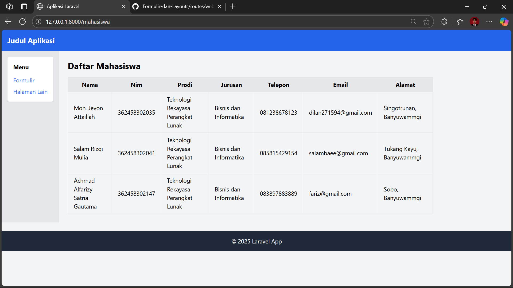
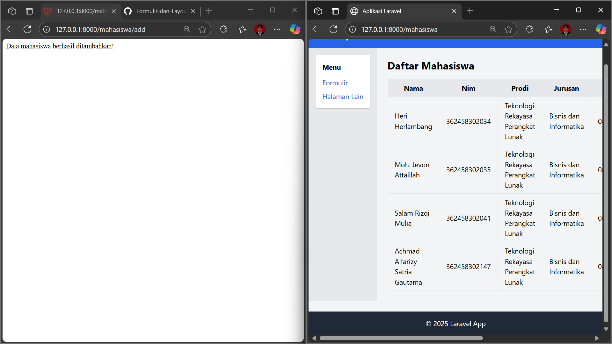
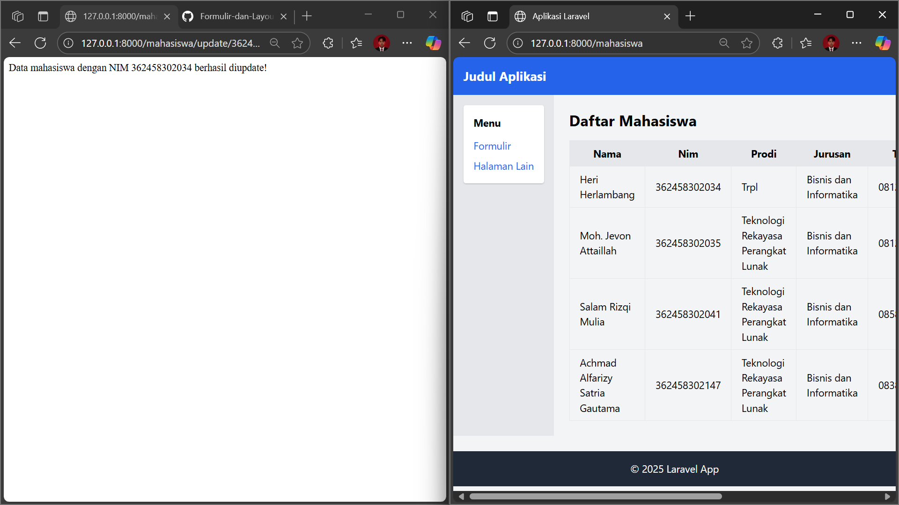
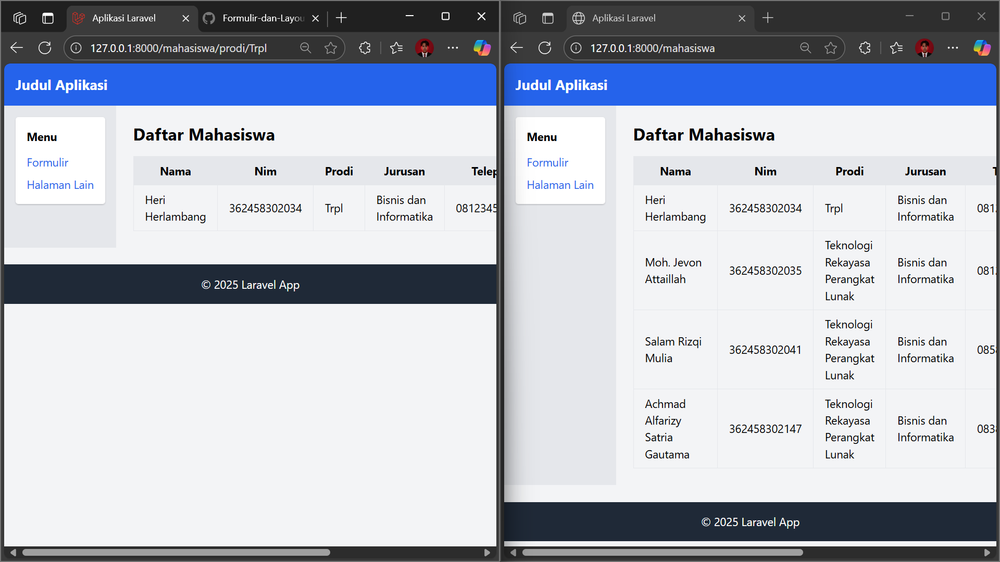
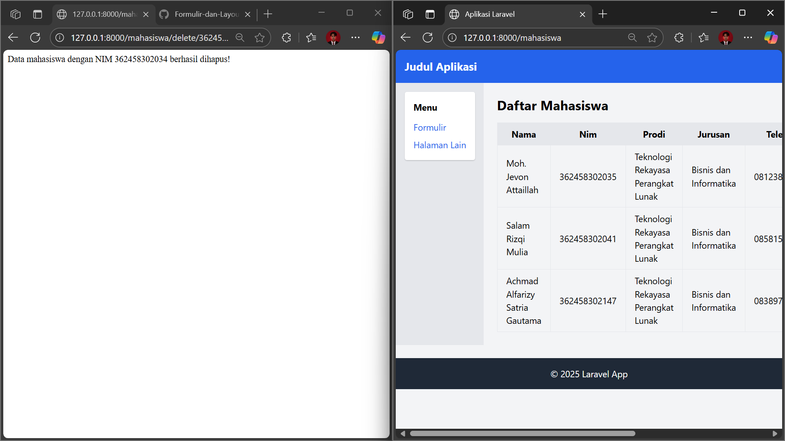

# Integrasi Database di Laravel (Migration, Seeder, dan Query Builder)

## 1. Menambahkan Kolom Baru di Migration
Pada file `database/migrations/2025_09_30_035925_create_mahasiswa.php`, ditambahkan kolom **nim**, **prodi**, dan **jurusan** agar tabel mahasiswa lebih lengkap.  
Migration berfungsi untuk membuat struktur tabel di database agar konsisten.

```php
<?php

use Illuminate\Database\Migrations\Migration;
use Illuminate\Database\Schema\Blueprint;
use Illuminate\Support\Facades\Schema;

return new class extends Migration
{
    public function up(): void
    {
        Schema::create('mahasiswa', function (Blueprint $table) {
            $table->id();
            $table->string('nama');
            $table->string('nim')->unique();
            $table->string('prodi');
            $table->string('jurusan');
            $table->string('telepon');
            $table->string('email');
            $table->text('alamat');
            $table->timestamps();
        });
    }

    public function down(): void
    {
        Schema::dropIfExists('mahasiswa');
    }
};
```

Jalankan perintah:
```bash
php artisan migrate
```

Jika gagal karena tabel lama masih ada, gunakan:
```bash
php artisan migrate:fresh
```
Perintah ini akan menghapus semua tabel lama lalu membuat ulang sesuai migration.

---

## 2. Menyinkronkan Seeder
Seeder digunakan untuk mengisi data awal ke tabel. Data ini bisa dipakai untuk uji coba.  
Pada `database/seeders/MahasiswaSeeder.php`, isi disesuaikan dengan kolom baru.

```php
<?php

namespace Database\Seeders;

use Illuminate\Database\Seeder;
use Illuminate\Support\Facades\DB;

class MahasiswaSeeder extends Seeder
{
    public function run(): void
    {
        DB::table('mahasiswa')->insert([
            [
                'nama' => 'Moh. Jevon Attaillah',
                'nim' => '362458302035',
                'prodi' => 'Teknologi Rekayasa Perangkat Lunak',
                'jurusan' => 'Bisnis dan Informatika',
                'telepon' => '081238678123',
                'email' => 'dilan271594@gmail.com',
                'alamat' => 'Singotrunan, Banyuwangi',
                'created_at' => now(),
                'updated_at' => now(),
            ],
            [
                'nama' => 'Salam Rizqi Mulia',
                'nim' => '362458302041',
                'prodi' => 'Teknologi Rekayasa Perangkat Lunak',
                'jurusan' => 'Bisnis dan Informatika',
                'telepon' => '085815429154',
                'email' => 'salambaee@gmail.com',
                'alamat' => 'Tukang Kayu, Banyuwangi',
                'created_at' => now(),
                'updated_at' => now(),
            ],
            [
                'nama' => 'Achmad Alfarizy Satria Gautama',
                'nim' => '362458302147',
                'prodi' => 'Teknologi Rekayasa Perangkat Lunak',
                'jurusan' => 'Bisnis dan Informatika',
                'telepon' => '083897883889',
                'email' => 'fariz@gmail.com',
                'alamat' => 'Sobo, Banyuwangi',
                'created_at' => now(),
                'updated_at' => now(),
            ],
        ]);
    }
}
```

Jalankan dengan:
```bash
php artisan db:seed --class=MahasiswaSeeder
```
Fungsinya untuk menambahkan data awal ke tabel `mahasiswa`.

---

## 3. Menambahkan Routing dengan Query Builder
Query Builder dipakai untuk operasi database tanpa perlu SQL manual.  
Tambahkan beberapa route di `routes/web.php` untuk **lihat data, tambah, update, dan hapus**.

```php
use Illuminate\Support\Facades\DB;

Route::get('/mahasiswa', function () {
    $mahasiswa = DB::table('mahasiswa')->get();
    return view('mahasiswa.index', compact('mahasiswa'));
});

Route::get('/mahasiswa/prodi/{prodi}', function ($prodi) {
    $mahasiswa = DB::table('mahasiswa')->where('prodi', $prodi)->get();
    return view('mahasiswa.index', compact('mahasiswa'));
});


Route::get('/mahasiswa/add', function () {
    DB::table('mahasiswa')->insert([
        [
            'nama' => 'Heri Herlambang',
            'nim' => '362458302034',
            'prodi' => 'Teknologi Rekayasa Perangkat Lunak',
            'jurusan' => 'Bisnis dan Informatika',
            'telepon' => '081234567890',
            'email' => 'heri@example.com',
            'alamat' => 'Situbondo',
            'created_at' => now(),
            'updated_at' => now(),
        ]
    ]);
    return "Data mahasiswa berhasil ditambahkan!";
});

Route::get('/mahasiswa/update/{nim}', function ($nim) {
    DB::table('mahasiswa')->where('nim', $nim)->update([
        'prodi' => 'Trpl'
    ]);
    return "Data mahasiswa dengan NIM $nim berhasil diupdate!";
});

Route::get('/mahasiswa/delete/{nim}', function ($nim) {
    DB::table('mahasiswa')->where('nim', $nim)->delete();
    return "Data mahasiswa dengan NIM $nim berhasil dihapus!";
});
```

---

## 4. View Tabel Mahasiswa
View digunakan untuk menampilkan data ke browser.  
File: `resources/views/mahasiswa/index.blade.php`

```php
@extends('layouts.app')

@section('content')
    <h2 class="text-2xl font-bold mb-4">Daftar Mahasiswa</h2>

    <table class="table-auto border-collapse border w-full">
        <thead>
            <tr class="bg-gray-200">
                <th class="border px-4 py-2">Nama</th>
                <th class="border px-4 py-2">NIM</th>
                <th class="border px-4 py-2">Prodi</th>
                <th class="border px-4 py-2">Jurusan</th>
                <th class="border px-4 py-2">Telepon</th>
                <th class="border px-4 py-2">Email</th>
                <th class="border px-4 py-2">Alamat</th>
            </tr>
        </thead>
        <tbody>
            @foreach($mahasiswa as $m)
                <tr>
                    <td class="border px-4 py-2">{{ $m->nama }}</td>
                    <td class="border px-4 py-2">{{ $m->nim }}</td>
                    <td class="border px-4 py-2">{{ $m->prodi }}</td>
                    <td class="border px-4 py-2">{{ $m->jurusan }}</td>
                    <td class="border px-4 py-2">{{ $m->telepon }}</td>
                    <td class="border px-4 py-2">{{ $m->email }}</td>
                    <td class="border px-4 py-2">{{ $m->alamat }}</td>
                </tr>
            @endforeach
        </tbody>
    </table>
@endsection
```

---

## 5. Uji Coba
Jalankan server:
```bash
php artisan serve
```

Coba akses:

- `http://localhost:8000/mahasiswa` (tampil semua data) 
    
- `http://localhost:8000/mahasiswa/add` (tambah data)
    
- `http://localhost:8000/mahasiswa/update/362458302034` (update data) berdasarkan NIM 
    
- `http://localhost:8000/mahasiswa/prodi/TRPL` (filter data per prodi)
    
- `http://localhost:8000/mahasiswa/delete/362458302041` (hapus data) berdasarkan NIM 
    

---

## Kesimpulan
- Migration digunakan untuk membuat dan menjaga struktur tabel.  
- Seeder dipakai untuk menambahkan data awal dengan cepat.  
- Query Builder memudahkan CRUD tanpa menulis SQL panjang.  
- Data mahasiswa sekarang lebih lengkap karena ada **NIM, Prodi, dan Jurusan**.  
