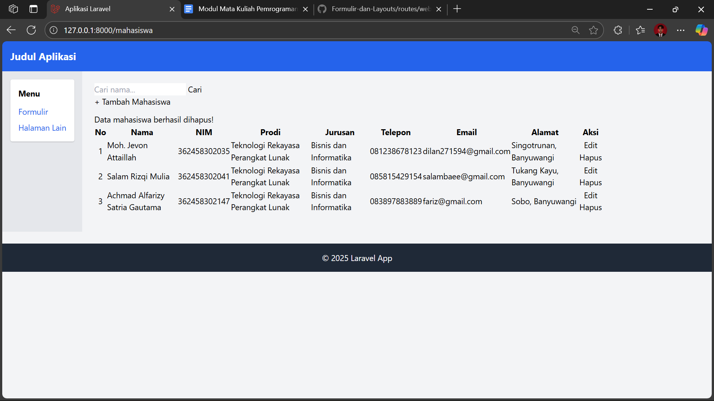

# Laporan Praktikum Laravel – Manajemen Data Mahasiswa dengan CRUD dan Formulir

**Nama:** Moh. Jevon Attaillah  
**NIM:** 362458302035  
**Jurusan:** Bisnis dan Informatika  
**Program Studi:** Teknologi Rekayasa Perangkat Lunak  
---

## Fitur Utama
- Menampilkan daftar mahasiswa.
- Menambahkan data mahasiswa baru.
- Mengedit dan menghapus data mahasiswa.
- Mencari mahasiswa berdasarkan nama.
- Menampilkan data dengan pagination.

---

## Daftar File yang Dimodifikasi / Ditambahkan

### 1. **Model: `app/Models/Mahasiswa.php`**
```php
<?php

namespace App\Models;

use Illuminate\Database\Eloquent\Factories\HasFactory;
use Illuminate\Database\Eloquent\Model;

class Mahasiswa extends Model
{
    use HasFactory;

    protected $table = 'mahasiswa';
    protected $primaryKey = 'nim';
    public $incrementing = false;
    protected $keyType = 'string';

    protected $fillable = [
        'nim', 'nama', 'prodi', 'jurusan', 'telepon', 'email', 'alamat'
    ];
}
```
**Penjelasan:**
- File ini **ditambahkan** untuk mendefinisikan struktur model `Mahasiswa`.
- Menentukan nama tabel, primary key (`nim`), dan kolom yang bisa diisi (`$fillable`).

---

### 2. **Controller: `app/Http/Controllers/MahasiswaController.php`**
```php
<?php

namespace App\Http\Controllers;

use App\Models\Mahasiswa;
use Illuminate\Http\Request;

class MahasiswaController extends Controller
{
    public function index(Request $request)
    {
        $search = $request->input('search');
        $mahasiswa = Mahasiswa::when($search, function ($query, $search) {
            return $query->where('nama', 'like', "%{$search}%");
        })->paginate(5);

        return view('mahasiswa.index', compact('mahasiswa', 'search'));
    }

    public function create()
    {
        return view('mahasiswa.create');
    }

    public function store(Request $request)
    {
        $request->validate([
            'nim' => 'required|unique:mahasiswa',
            'nama' => 'required',
            'prodi' => 'required',
            'jurusan' => 'required',
            'telepon' => 'required',
            'email' => 'required|email',
            'alamat' => 'required',
        ]);

        Mahasiswa::create($request->all());

        return redirect()->route('mahasiswa.index')->with('success', 'Data berhasil ditambahkan!');
    }

    public function edit($nim)
    {
        $mahasiswa = Mahasiswa::findOrFail($nim);
        return view('mahasiswa.edit', compact('mahasiswa'));
    }

    public function update(Request $request, $nim)
    {
        $mahasiswa = Mahasiswa::findOrFail($nim);
        $mahasiswa->update($request->all());

        return redirect()->route('mahasiswa.index')->with('success', 'Data berhasil diperbarui!');
    }

    public function destroy($nim)
    {
        Mahasiswa::destroy($nim);
        return redirect()->route('mahasiswa.index')->with('success', 'Data berhasil dihapus!');
    }
}
```
**Penjelasan:**
- File ini **ditambahkan** untuk mengatur seluruh proses CRUD Mahasiswa.
- Menangani pencarian, penyimpanan, pembaruan, dan penghapusan data.

---

### 3. **Routes: `routes/web.php`**
```php
use App\Http\Controllers\MahasiswaController;

Route::get('/mahasiswa', [MahasiswaController::class, 'index'])->name('mahasiswa.index');
Route::get('/mahasiswa/create', [MahasiswaController::class, 'create'])->name('mahasiswa.create');
Route::post('/mahasiswa', [MahasiswaController::class, 'store'])->name('mahasiswa.store');
Route::get('/mahasiswa/edit/{nim}', [MahasiswaController::class, 'edit'])->name('mahasiswa.edit');
Route::put('/mahasiswa/{nim}', [MahasiswaController::class, 'update'])->name('mahasiswa.update');
Route::delete('/mahasiswa/{nim}', [MahasiswaController::class, 'destroy'])->name('mahasiswa.destroy');
```
**Penjelasan:**
- Route baru **ditambahkan** agar setiap aksi CRUD dapat diakses melalui URL tertentu.
- Menggunakan `MahasiswaController` sebagai pengendali utama.

---

### 4. **View: `resources/views/mahasiswa/index.blade.php`**
```blade
@extends('layouts.app')

@section('content')
<div class="d-flex justify-content-between mb-3">
    <form action="{{ route('mahasiswa.index') }}" method="GET" class="d-flex">
        <input type="text" name="search" class="form-control me-2" placeholder="Cari nama..." value="{{ $search }}">
        <button class="btn btn-outline-primary">Cari</button>
    </form>
    <a href="{{ route('mahasiswa.create') }}" class="btn btn-success">+ Tambah Mahasiswa</a>
</div>

@if(session('success'))
    <div class="alert alert-success">{{ session('success') }}</div>
@endif

<table class="table table-bordered table-striped text-center align-middle">
    <thead class="table-primary">
        <tr>
            <th>No</th>
            <th>Nama</th>
            <th>NIM</th>
            <th>Prodi</th>
            <th>Jurusan</th>
            <th>Telepon</th>
            <th>Email</th>
            <th>Alamat</th>
            <th>Aksi</th>
        </tr>
    </thead>
    <tbody>
        @foreach($mahasiswa as $m)
        <tr>
            <td>{{ $loop->iteration + ($mahasiswa->currentPage() - 1) * $mahasiswa->perPage() }}</td>
            <td>{{ $m->nama }}</td>
            <td>{{ $m->nim }}</td>
            <td>{{ $m->prodi }}</td>
            <td>{{ $m->jurusan }}</td>
            <td>{{ $m->telepon }}</td>
            <td>{{ $m->email }}</td>
            <td>{{ $m->alamat }}</td>
            <td>
                <a href="{{ route('mahasiswa.edit', $m->nim) }}" class="btn btn-warning btn-sm">Edit</a>
                <form action="{{ route('mahasiswa.destroy', $m->nim) }}" method="POST" class="d-inline">
                    @csrf
                    @method('DELETE')
                    <button class="btn btn-danger btn-sm" onclick="return confirm('Yakin ingin menghapus?')">Hapus</button>
                </form>
            </td>
        </tr>
        @endforeach
    </tbody>
</table>

<div class="d-flex justify-content-center">
    {{ $mahasiswa->links() }}
</div>
@endsection
```
**Penjelasan:**
- File **diperbarui total** agar tampilan tabel mahasiswa lebih rapi.
- Ditambahkan fitur **pencarian**, **pagination**, dan **aksi Edit/Hapus**.

---

### 5. **View Tambah/Edit (`create.blade.php` & `edit.blade.php`)**
File `create.blade.php` dan `edit.blade.php` berfungsi sebagai form input dan update data mahasiswa.

---

## Hasil Tampilan
Tampilan halaman daftar mahasiswa setelah modifikasi:



---

## Kesimpulan
Dengan penerapan struktur MVC pada Laravel, pengelolaan data mahasiswa menjadi lebih terorganisir, efisien, dan mudah dikembangkan.  
Penambahan fitur pencarian, pagination, dan validasi membuat aplikasi lebih dinamis serta user-friendly.